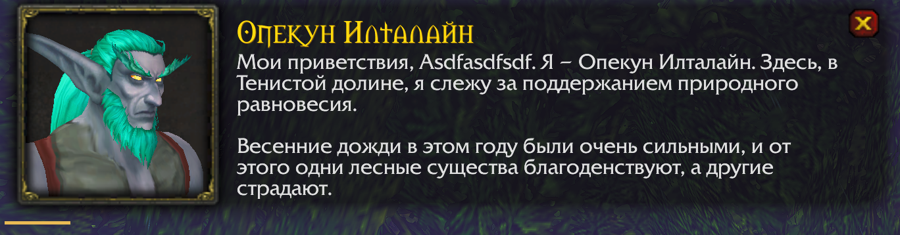
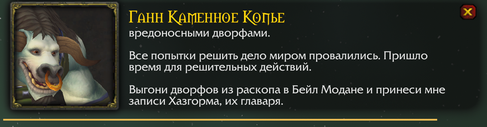
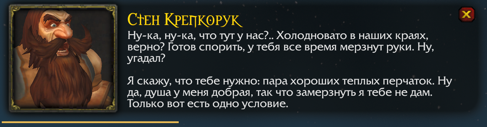
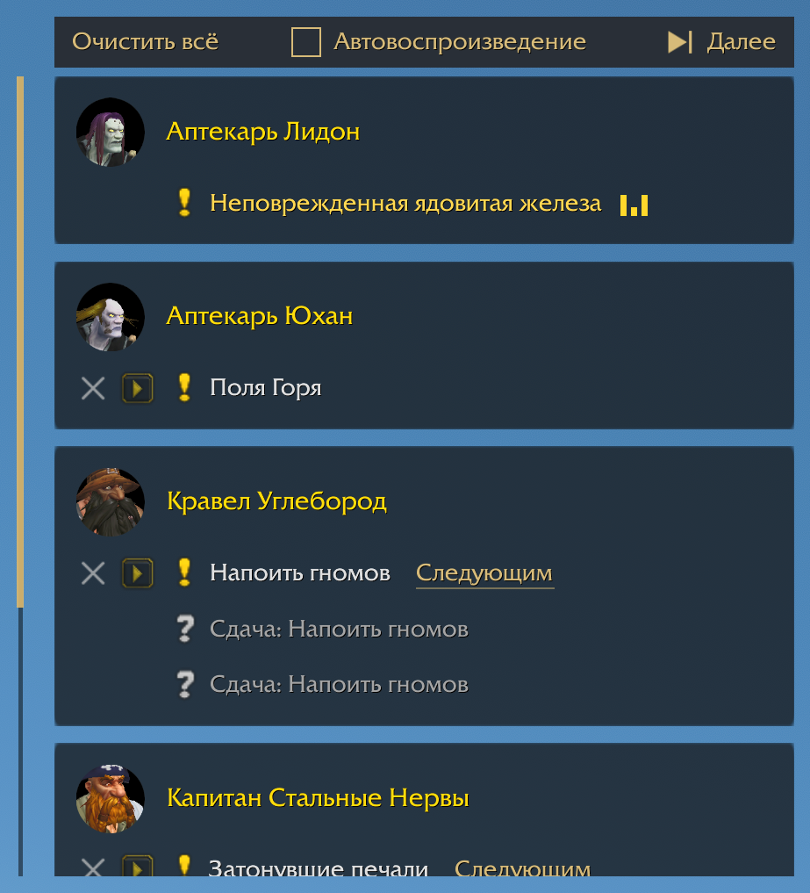

# TalkingHead Ru

Русская озвучка квестов для **WoW Forever Beta** с говорящей головой в стиле Retail.
Во время воспроизведения на экране отображаются портрет персонажа и текст реплики.
Описание задания можно повторно прослушать кнопкой ▶ в журнале или списке заданий.
На английском клиенте кнопки плеера отображаются на английском, настройки — на русском.
Говорящая голова использует шрифты заданий Blizzard, включая их кириллические варианты.

**[Скачать аддон](https://github.com/olegbuchnev/WowVoiceTalkingHead/releases/download/v1.2.6-forever/TalkingHeadRu-1.2.6-forever.zip)** ·
[Инструкция](USER_README.md) ·
[Сообщить об ошибке](https://github.com/olegbuchnev/WowVoiceTalkingHead/issues)

## Три библиотеки озвучки

Подключите **WowVoice, CatQuest или Wayfarer** в любом сочетании.
В настройках можно выбрать приоритет библиотек озвучки.
Если записи нет в первой библиотеке, TalkingHead Ru проверит следующую.
Выбранный порядок сохраняется и при отключении библиотек.

В каталоге «Послушать озвучку» можно сравнить все три варианта.

Озвучкой и очередью для всех трёх библиотек управляет TalkingHead Ru.
Что установить для каждой из них — в разделе [«Подключение библиотек»](#подключение-библиотек).

## Возможности

- **Панель в стиле Retail.** Портрет собеседника, его имя и текст реплики.
  Положение и масштаб панели можно изменить в настройках.
- **Более 4 900 заданий с озвучкой.** Классические истории и дополнительные квесты
  Forever при установленном CatQuest Voices; основная база WowVoice содержит
  4 205 заданий. Набор записей зависит от задания:
  озвучены не все этапы и реплики.
- **Настраиваемый автозапуск.** Озвучку при получении и сдаче задания можно
  отключить независимо друг от друга и запускать описание вручную.
- **Повторное прослушивание.** Кнопки ▶ в журнале, стандартном списке заданий и Questie Tracker
  позволяют включить описание без возвращения к квестодателю.
- **Подсветка кнопки при прогрессе задания.** Напоминает о непрослушанном
  описании.

## Очередь озвучки

Принятые задания и реплики сдачи группируются по квестодателям.
Можно послушать любую запись сразу или поставить следующей.

«Автовоспроизведение» включает проигрывание подряд. Если снять галочку,
текущая реплика доиграет, а следующая будет ждать клика на «Далее» или ▶ у задания.

«Очистить всё» удаляет очередь и останавливает озвучку.

## Подключение библиотек

Библиотеки обновляются отдельно. Совместимые обновления CatQuest и Wayfarer
продолжают работать; если длительности новых записей ещё не проверены,
об этом сообщит подсказка в настройках.

### WowVoice

Озвучка классических заданий — 3 669 основных описаний.

**Что установить:** [WowVoice на CurseForge](https://www.curseforge.com/wow/addons/wowvoice-classic/files/all?page=1&pageSize=20&gameVersionTypeId=88568&showAlphaFiles=hide).
В списке модификаций оставьте включённой библиотеку `WowVoiceSounds`.

**Как работает с TalkingHead Ru:** основной аддон `WowVoice` отключается
автоматически, чтобы задания не звучали дважды. Его библиотека остаётся доступной.

### CatQuest

Альтернативная озвучка классических заданий и дополнительные квесты Forever — 3 017 основных описаний.

**Что установить:** [CatQuest](https://www.curseforge.com/wow/addons/catquest/files/all?page=1&pageSize=20&gameVersionTypeId=88568&showAlphaFiles=hide)
и [CatQuest Voices](https://www.curseforge.com/wow/addons/catquest-voices/files/all?page=1&pageSize=20&gameVersionTypeId=88568&showAlphaFiles=hide).
Включите оба аддона: `CatQuest` и `CatQuest_Voices`.

**Как работает с TalkingHead Ru:** автозапуск квестов и кнопки CatQuest
в диалогах, журнале и списке заданий временно отключаются. Книги и лор мест остаются доступны.
При отключении TalkingHead Ru исходные настройки и кнопки восстанавливаются.

### Wayfarer

Озвучка заданий Альянса, Орды и общих заданий — 3 358 основных описаний в трёх модулях.
Часть заданий также озвучена другими библиотеками.

**Что установить:** [Wayfarer - Russian VoiceOver](https://www.curseforge.com/wow/addons/wayfarer-russian-voiceover/files/all?page=1&pageSize=20&gameVersionTypeId=88568&showAlphaFiles=hide).
**Рекомендуем установить все три квестовых модуля**, чтобы получить полный каталог:
[Wayfarer Voices - Alliance](https://www.curseforge.com/wow/addons/wayfarer-voices-alliance/files/all?page=1&pageSize=20&gameVersionTypeId=88568&showAlphaFiles=hide),
[Wayfarer Voices - Horde](https://www.curseforge.com/wow/addons/wayfarer-voices-horde/files/all?page=1&pageSize=20&gameVersionTypeId=88568&showAlphaFiles=hide)
и [Wayfarer Voices - Shared Quests](https://www.curseforge.com/wow/addons/wayfarer-voices-shared-quests/files/all?page=1&pageSize=20&gameVersionTypeId=88568&showAlphaFiles=hide).
Включите основной аддон и голосовые модули. Narrator для квестовой библиотеки не нужен.

**Как работает с TalkingHead Ru:** автозапуск квестов, кнопки прослушивания в журнале
и списке заданий и уведомления Wayfarer подавляются. При отключении TalkingHead Ru
кнопки и автозапуск восстанавливаются. Отдельные функции книг и лора сохраняются. Можно использовать часть
модулей; недостающие перечислены в подсказке на карточке библиотеки.

## Установка

> **Аддон переименован в TalkingHead Ru для публикации на CurseForge.**
>
> **⚠ Обновляетесь со старой версии?**
>
> Перед установкой новой версии **полностью закройте игру**. Рекомендуется
> вручную удалить старую папку аддона и его сохранения. Все пути ниже указаны
> от папки `_classic_beta_`:
>
> - `Interface/AddOns/WowVoiceTalkingHead/` — старая папка аддона.
> - `WTF/Account/<аккаунт>/SavedVariables/WowVoiceTalkingHead.lua` — старые настройки.
> - `WTF/Account/<аккаунт>/<сервер>/<персонаж>/SavedVariables/WowVoiceTalkingHead.lua` — старая очередь персонажа.
>
> Если рядом есть файлы `WowVoiceTalkingHead.lua.bak`, удалите и их.
> Вместо `<аккаунт>`, `<сервер>` и `<персонаж>` откройте соответствующие папки;
> повторите очистку для аккаунтов и персонажей, на которых использовали старый аддон.
>
> **Прежние настройки и очередь не переносятся.** Положение, масштаб панелей
> и остальные параметры потребуется настроить заново один раз.
> Сохранения новой версии `TalkingHeadRu.lua` удалять не нужно.

1. **[Скачайте аддон](https://github.com/olegbuchnev/WowVoiceTalkingHead/releases/download/v1.2.6-forever/TalkingHeadRu-1.2.6-forever.zip)**.
   Закройте игру и скопируйте папку `TalkingHeadRu` из архива
   в `_classic_beta_/Interface/AddOns/`.
2. **Установите одну или несколько библиотек для Forever:**
   [WowVoice](https://www.curseforge.com/wow/addons/wowvoice-classic/files/all?page=1&pageSize=20&gameVersionTypeId=88568&showAlphaFiles=hide)
   или [CatQuest](https://www.curseforge.com/wow/addons/catquest/files/all?page=1&pageSize=20&gameVersionTypeId=88568&showAlphaFiles=hide)
   вместе с [CatQuest Voices](https://www.curseforge.com/wow/addons/catquest-voices/files/all?page=1&pageSize=20&gameVersionTypeId=88568&showAlphaFiles=hide),
   либо [Wayfarer с голосовыми модулями](#подключение-библиотек).
   Папки библиотек также поместите в `AddOns`.
3. **Запустите игру** и включите TalkingHead Ru и выбранные библиотеки в списке модификаций.
   Для WowVoice нужна `WowVoiceSounds`; для CatQuest — `CatQuest` и `CatQuest_Voices`.
   Для Wayfarer — `Wayfarer` и выбранные `Wayfarer_Voices_Alliance`,
   `Wayfarer_Voices_Horde`, `Wayfarer_Voices_Shared`.

Основной аддон `WowVoice` из комплекта CurseForge TalkingHead отключает автоматически,
чтобы задания не звучали дважды. `WowVoiceSounds` остаётся включённым.
Приветствие и напоминание о Boosty от оригинального WowVoice также убираются из чата.
TalkingHead показывает одну общую строку со ссылками на авторов загруженных библиотек.

**Обновление:** скачайте тот же архив аддона, замените папку аддона
и полностью перезапустите игру. Библиотеки обновляются отдельно через CurseForge;
при обычном обновлении TalkingHead удалять их не нужно.

В новой сборке папка аддона называется `TalkingHeadRu`, файл настроек —
`TalkingHeadRu.lua`. При переходе выполните очистку по инструкции в начале раздела.
Последующие обновления сохраняют настройки.
В опубликованных ранее архивах используется прежнее имя папки.
Если старую папку забыли удалить, TalkingHead Ru автоматически отключит прежний
аддон. Если он уже загрузился, нажмите «Перезагрузить интерфейс» в уведомлении
или выполните `/reload`, чтобы завершить переключение.

## Настройки

Введите **`/thead`** или откройте **Параметры → Модификации → TalkingHead Ru**,
чтобы выбрать автозапуск и порядок библиотек, настроить плейлист
или изменить положение и масштаб говорящей головы. В разделе
«Выбор озвучки» также доступен каталог «Послушать озвучку». Чтобы остановить реплику,
нажмите крестик на панели. Повторить описание можно кнопкой ▶ у задания.

Подробнее о настройках, звуке и решении проблем — в [инструкции](USER_README.md).
Сборка предназначена для **WoW Forever Beta**. Поддерживаются стандартный трекер
(в том числе с оформлением EllesmereUI) и Questie Tracker. В собственных списках
других аддонов кнопки могут отсутствовать.

## Авторы и озвучка

**Связь с разработчиком аддона — Discord: Tove#2889.**
Если что-то не работает, есть вопрос или идея для улучшения — напишите.
О проблеме также можно сообщить по ссылке «Сообщить об ошибке» внизу страницы.

Аддон поддерживает три библиотеки озвучки:

- **[WowVoice](https://boosty.to/wowvoice)** — озвучка классических заданий.
- **[CatQuest](https://boosty.to/cathey)** — альтернативная озвучка классических заданий и дополнительные квесты Forever.
- **[Wayfarer](https://discord.gg/sgTeeQCZvh)** — озвучка заданий Альянса, Орды и общих заданий.

Поддержать авторов и связаться с ними можно по ссылкам выше.

## Что нового

<strong>Версия 1.3.0-forever</strong> · <time datetime="2026-10-10">10 октября 2026</time>

- **Поддержка Wayfarer.** Третья библиотека озвучки с 3 358 описаниями заданий. Рекомендуем установить все три голосовых модуля, чтобы получить полный каталог.
- **Приоритет перетаскиванием.** Расставьте WowVoice, CatQuest и Wayfarer в нужном порядке. Если записи нет, используется следующая библиотека.
- **Каталог трёх озвучек.** У записи Wayfarer можно увидеть её модуль. Записи незагруженных модулей сразу неактивны, а карточка библиотеки показывает предупреждение.
- **Больше русских текстов.** Тексты из CatQuest и Wayfarer собраны в общую базу. Выбор голоса не меняет текст задания.
- **Точные длительности Wayfarer.** Измерены все 7 296 квестовых аудиофайлов проверенных модулей. Обновления библиотек отмечаются в настройках.
- **Улучшены настройки.** Краткие подсказки, курсор перемещения карточек и русский текст при разблокировке панелей на английском клиенте.
- **Единое управление квестовой озвучкой.** Автозапуск и квестовые кнопки Wayfarer и CatQuest временно отключаются, пока включён TalkingHead Ru. Книги и лор остаются доступны. Уведомления Wayfarer скрыты, а стартовое сообщение показывает ссылки только на загруженные библиотеки.

<strong>Версия 1.2.6-forever</strong> · <time datetime="2026-10-09">9 октября 2026</time>

- **Обновлена поддержка CatQuest 0.5.0.** В библиотеке CatQuest появилось ещё 951 задание с озвучкой. Обновлены тексты реплик, длительности записей и данные персонажей.
- **Аддон переименован в TalkingHead Ru.** Новое название используется в списке модификаций и настройках. Оставшаяся старая версия WowVoiceTalkingHead отключается автоматически, чтобы избежать конфликтов.
- **Исправлена ошибка при запуске озвучки после обновления беты**, связанная с ограниченным доступом к данным персонажей.
- **Исправлены подсказки в настройках на английском клиенте:** русский текст отображается корректно, а размер подсказки соответствует содержимому.
- **Убраны стартовые и рекламные сообщения оригинального WowVoice** при включённом TalkingHead Ru.

> **Аддон переименован в TalkingHead Ru для публикации на CurseForge.**
>
> **⚠ Обновляетесь со старой версии?**
>
> Перед установкой новой версии **полностью закройте игру**. Рекомендуется
> вручную удалить старую папку аддона и его сохранения. Все пути ниже указаны
> от папки `_classic_beta_`:
>
> - `Interface/AddOns/WowVoiceTalkingHead/` — старая папка аддона.
> - `WTF/Account/<аккаунт>/SavedVariables/WowVoiceTalkingHead.lua` — старые настройки.
> - `WTF/Account/<аккаунт>/<сервер>/<персонаж>/SavedVariables/WowVoiceTalkingHead.lua` — старая очередь персонажа.
>
> Если рядом есть файлы `WowVoiceTalkingHead.lua.bak`, удалите и их.
> Вместо `<аккаунт>`, `<сервер>` и `<персонаж>` откройте соответствующие папки;
> повторите очистку для аккаунтов и персонажей, на которых использовали старый аддон.
>
> **Прежние настройки и очередь не переносятся.** Положение, масштаб панелей
> и остальные параметры потребуется настроить заново один раз.
> Сохранения новой версии `TalkingHeadRu.lua` удалять не нужно.

<strong>Версия 1.2.5-forever</strong> · <time datetime="2026-10-04">4 октября 2026</time>

- **Озвучка устанавливается отдельно.** Ссылки на WowVoice и CatQuest для Forever теперь собраны на сайте рядом со скачиванием аддона.
- **Основной аддон WowVoice отключается автоматически**, чтобы избежать двойного воспроизведения. Его библиотека озвучки остаётся включённой.

> **⚠ Раньше скачивали полный архив?**
>
> Перед переходом на [WowVoice из CurseForge](https://www.curseforge.com/wow/addons/wowvoice-classic/files/all?page=1&pageSize=20&gameVersionTypeId=88568&showAlphaFiles=hide)
> закройте игру и удалите старую папку `WowVoiceSounds` из `Interface/AddOns`.
> Затем установите озвучку из CurseForge. Настройки и история сохранятся.

<strong>Версия 1.2.4-forever</strong> · <time datetime="2026-10-04">4 октября 2026</time>

- **Обновлена поддержка CatQuest 0.4.0.** Библиотека озвучки пополнилась 147 заданиями. Обновлены тексты, длительности записей и данные персонажей.
- **Голова появляется только при доступной озвучке.** Реплики без записи в подключённых библиотеках больше не попадают в очередь.
- **Убрано краткое появление плейлиста** при запуске единственной записи после принятия задания.
- **Исправлена вспышка заполненной полосы прогресса** при появлении следующей головы.
- **Исправлен ракурс камеры для женщин-орков.**

<strong>Версия 1.2.3-forever</strong> · <time datetime="2026-10-02">2 октября 2026</time>

- **Озвучка на выбор.** Можно подключить WowVoice, CatQuest или оба пакета.
  Без них говорящая голова и плеер продолжают показывать текст заданий.
- **Поддержка обновлений CatQuest.** Обновление пакета больше не отключает всю
  озвучку. Новые и изменённые записи доступны сразу, хотя до уточнения их
  длительности возможны неточности.
- **Уточнена длительность записей WowVoice.** Голова и переходы между треками
  лучше совпадают с озвучкой.
- **Улучшена работа на английском клиенте.** Переведены кнопки плеера, исправлены
  шрифты и отображение кириллицы. Тексты заданий показываются на русском, если
  есть перевод, иначе — на языке клиента. Настройки остаются на русском.
- **Крестик на голове пропускает текущую запись.** При включённом
  автовоспроизведении очередь переходит к следующей.
- **«Вспомнить задание» не появляется, если описание уже находится в очереди.**
- **Исправлено восстановление после `/reload` и короткого перезахода.**
  Прерванная запись начинается заново и звучит целиком. Анимация головы работает,
  очередь и настройка автовоспроизведения сохраняются.
- **Меню «Озвучка заданий» показывает записи отключённых библиотек.** Недоступная озвучка
  отмечена крестиком.
- **Скрыта лишняя кнопка «Читать» от CatQuest** в диалогах с NPC на всех языках клиента.

---

[Подробная инструкция](USER_README.md) · [Документация для разработчиков](docs/DEVELOPMENT.md)
